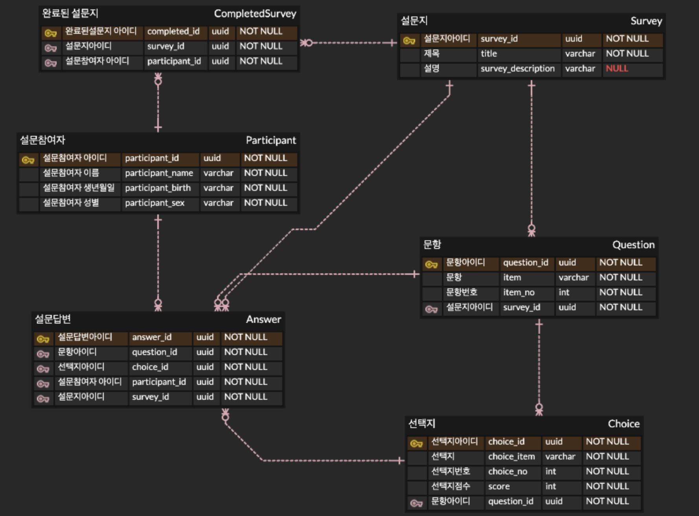

# [마음연구소] 과제전형 - 코딩 테스트 버전 3

## 🖥️  프로젝트 설명
### 1. 설문지 프로젝트
  - 익명의 참여자가 설문을 한다는 생각으로 개발 하였습니다.
### 2. API 기능
  - 설문지 CRUD
  - 문항 CRUD
  - 선택지 CRUD
  - 답변 CRUD
  - 설문지 완료
  - 완료된 설문지 확인
    - 조회 시 답변의 총점이 같이 반환됩니다.
### 3. ERD


## 🚀 설치방법
  1. [docker 공식 사이트](https://www.docker.com/get-started/) 에서 환경에 맞춰 설치 해주세요.
    자동으로 docker compose도 같이 설치가 됩니다.
  2. .env 파일을 생성 하여 아래의 값을 입력해줍니다.
  ```bash
    PORT = 4000
    DEV_MODE = 'dev'

    DB_PORT = 5432
    DB_HOST = psql_db
    DB_NAME = survey
    DB_USERNAME = admin
    DB_PWD = qwer1234
  ```


## 🚀 실행방법

```bash
$ docker compose up --build
```
